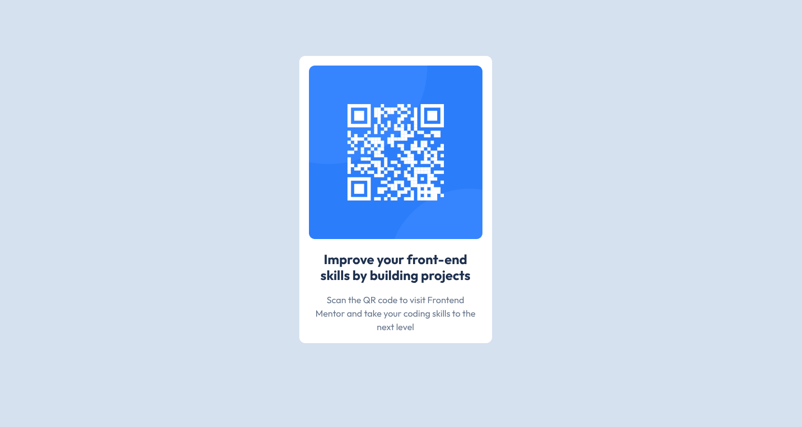

# Frontend Mentor - QR code component solution

This is a solution to the [QR code component challenge on Frontend Mentor](https://www.frontendmentor.io/challenges/qr-code-component-iux_sIO_H). Frontend Mentor challenges help you improve your coding skills by building realistic projects.

## Table of contents

- [Overview](#overview)
  - [Screenshot](#screenshot)
  - [Links](#links)
- [My process](#my-process)
  - [Built with](#built-with)
  - [What I learned](#what-i-learned)
  - [Continued development](#continued-development)
  - [Useful resources](#useful-resources)
- [Author](#author)
- [Acknowledgments](#acknowledgments)

## Overview

A QR CODE Component coded with html and CSS

### Screenshot

### Links

- Solution URL: [Add solution URL here](https://your-solution-url.com)
- Live Site URL: [Add live site URL here](https://your-live-site-url.com)

## My process

### Built with

- Semantic HTML5 markup
- CSS custom properties
- CSS variables
- Flexbox
- Mobile-first workflow

### What I learned

Nothing new, used my previous experience

### Continued development

Based on corrections or Suggestions, I might come back to refine this

### Useful resources

- [Google Fonts](https://www.fonts.google.com) - This helped me for XYZ reason. I really liked this pattern and will use it going forward.

## Author

- Website - [Chimobi Ekwunife](https://www.github.com/MrEkeunife)
- Frontend Mentor - [@MrEkwunife](https://www.frontendmentor.io/profile/MrEkwunife)
- Twitter - [@MrEkwunife](https://www.x.com/MrEkwunife)

## Acknowledgments

Just a big Thanks to FrontendMasters and FrontendMentors for the opportunity to get my basics right
